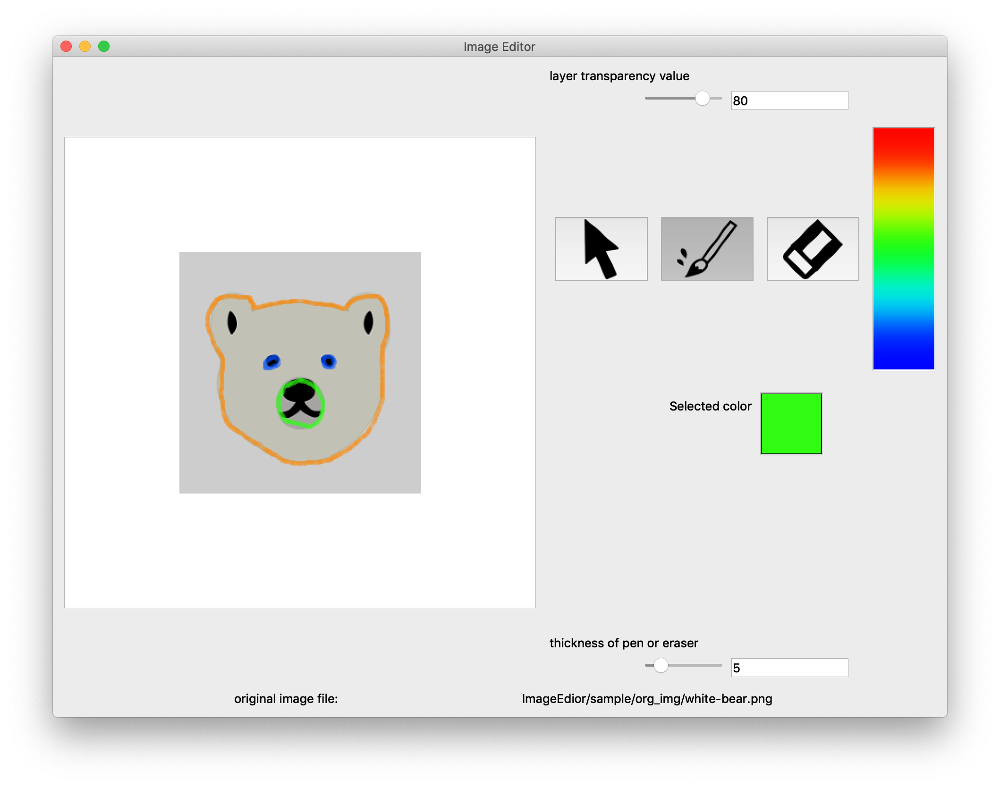

# Image Editor Application
Application of Image viewer function and drawing and file saving funcion on layer image has tranparency value.  


# Required
This application made by Qt for Python (PySide2).
For Anaconda user, to install run the command below.

```bash
conda install -c conda-forge pyside2
```

# Start application

```bash
python main.py
```

# Screen shot
